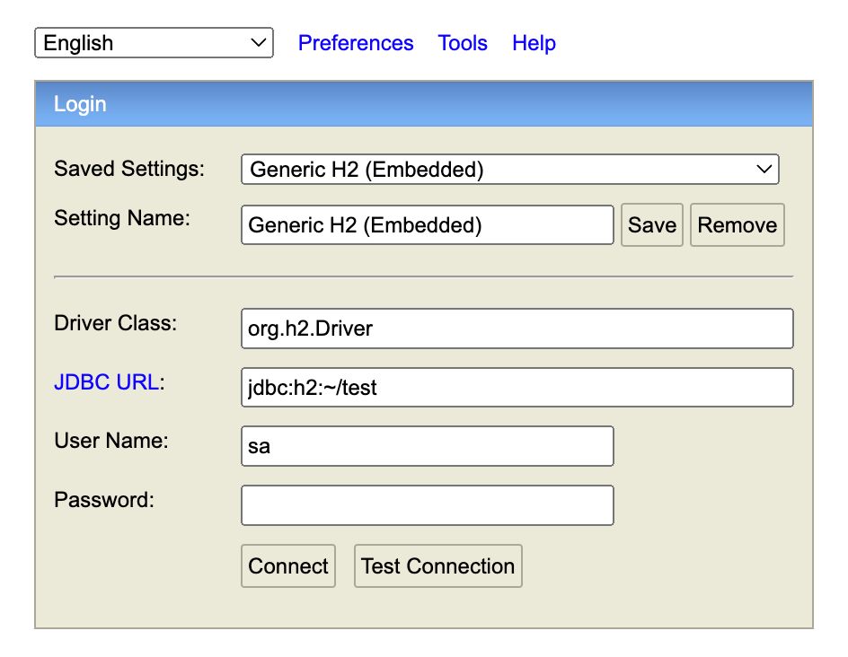

# 과제 2 - 배송비/반품비 계산

## 프로젝트 설명 ##
구현된 프로젝트는 기본적으로 주문데이터가 DB에 이미 저장되어 있는 상태에서 클레임(환불/교환)이 접수된다는 가정하에 구현되었습니다. 
서버 구동 시 과제 예시 주문 데이터가 적재됩니다.   

## 환경 구성 ##

Embedded H2 Database 를 사용하여 로컬환경에서는 추가 설정이 필요하지 않음.
1. com.musinsa.assignment.DeliveryManagementApplication.main() 메서드를 실행하여 Embedded Tomcat을 구동한다.
2. 브라우저에 http://localhost:8080/h2-console 을 입력하여 저장된 데이터를 확인한다.
    
    Password가 존재하지 않아 'connect'를 선택하면, 테이블 및 데이터를 확인할 수 있다.

### 통합 테스트 ###
아래 파일의 테스트 코드를 실행하여 주문번호 1번과 2번에 대한 통합테스트를 수행할 있다.
##### /src/test/java/com.musinsa.assignment #####
##### ㄴ OrderOneIntegrationTests : 주문번호 1에 대한 통합테스트 #####
실행 순서 : 신발A 교환 접수 -> 신발B 환불 접수 -> 신발C, 신불A` 환불 접수 -> 접수된 클레임에 대한 반품비 조회  
#####  #####
##### ㄴ OrderTwoIntegrationTests : 주문번호 2에 대한 통합테스트 #####
실행 순서 : 티셔츠A 교환 접수 -> 티셔츠B, 티셔츠C 환불 접수 -> 접수된 클레임에 대한 반품비 조회

